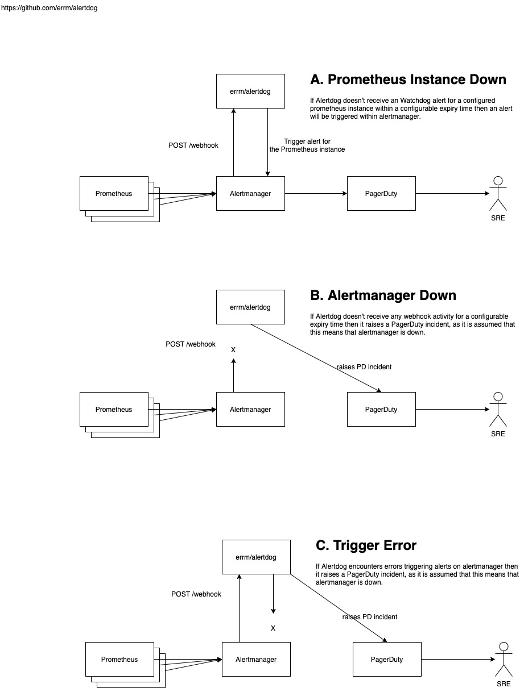

# Alertdog Design

Date: Feb/March 2021
Author: @errm

## Overview

Alertdog is software system to detect failures in a prometheus + alertmanager
alerting system.

It is a so called ["Dead mans switch"](https://en.wikipedia.org/wiki/Dead_man%27s_switch)
or ["Watchdog timer"](https://en.wikipedia.org/wiki/Watchdog_timer)

## Background / context

Alertdog is being developed for use in Cookpad's global organisation.

Within Cookpad we have several different teams who operate there own prometheus
clusters to monitor platform (Kubernetes) and application metrics.

We make use of a single alertmanager cluster to route alerts generated by
all prometheus clusters to the correct team. This alertmanager cluster is
maintained by our SRE team as a service to the other teams.

## Goals

* Alert a particular team if a/the prometheus cluster they operate is not
  correctly delivering alerts to alertmanager.
  * Make use of existing alertmanager routing and receivers to deliver alerts
  based on each teams preferences. e.g. to slack, PagerDuty or email etc...
* Alert the team who manages alertmanager via pagerduty if alertmanager is down.

## Proposed design

* Alertdog will expose a webhook endpoint.
* Prometheus should be configured to produce an always on "Watchdog" alert [e.g.](https://github.com/prometheus-operator/kube-prometheus/blob/1bf43811174355359e5316b52bfb1a0b928550b2/jsonnet/kube-prometheus/components/mixin/alerts/general.libsonnet#L19-L31) for an example of a watchdog alert.
* Alertmanager should be configured to route these alerts to the Alertdog webhook.

1. If Alertdog doesn't receive an Watchdog alert for a configured prometheus
instance within a configurable expiry time then we consider that that
prometheus instance is down and trigger an alert within alertmanager.
1. If  Alertdog doesn't receive *any* webhook activity for a configurable expiry
time then we consider that alertmanager is down, and raise a PagerDuty incident.
* If  Alertdog encounters errors triggering alerts on alertmanager then, we
consider that alertmanager is down, and raise a PagerDuty incident.
  * We will only trigger an incident if we cannot successfully trigger the
  alert on all configured alertmanager instances, this is the same as the [prometheus design](https://github.com/prometheus/prometheus/blob/4e5b1722b342948a55b3d7753f6539040db0e5f0/notifier/notifier.go#L449-L450)

 _Thanks @kenju_

## Alternative Designs

### https://github.com/tomaszkiewicz/prometheus-alertmanager-cloudwatch-webhook

* Webhook updates cloudwatch metrics
* Cloudwatch alarms notify when prometheus is down

### https://github.com/KierranM/deadmanswatch

* Similar cloud watch based solution

### https://github.com/BarthV/alertmanager-deadman-receiver

* Most similar design to alertdog
* Alerts directly to slack or PagerDuty, additional receivers would need code changes / extra config.
* Doesn't have configuration for which prometheus clusters should be up, rather alerts when and alert that was being received stops being received.
  * This is elegant, but could be unreliable if the process is restarted.
